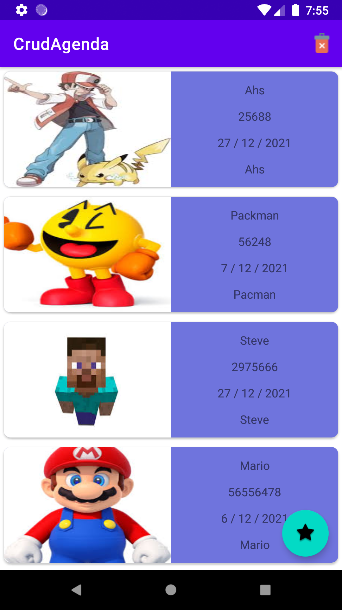
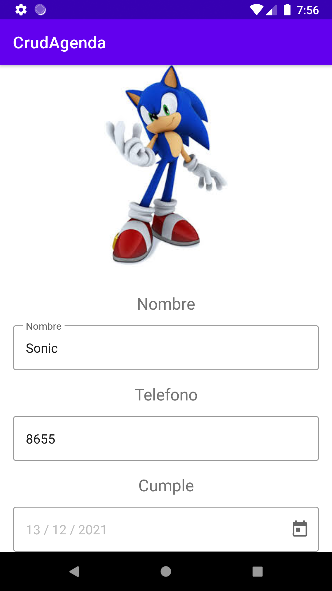
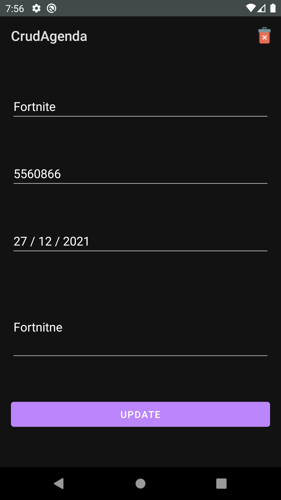

# Agenda

Aplicacion crud android en la cual puedes leer,actualizar,eliminar y editar 
los contactos

## Features
- Fragments
- Navigation component
- Rom database
- Corutines
- ViewBinding
- MVVM
- Dagger-Hilt
- Demo https://www.youtube.com/watch?v=AnXiGef8is0

#Capturas

  <table>
    <td>
      <tr>
        <th>Lista de contactos</th>
        <th>Ingresar contacto</th>
        <th>Ingresar contacto</th>
        <th>Actualizar/Eliminar contacto</th>
      </tr>
      <tr>
        <td></td>
        <td></td>
         <td></td>
        <td></td>
      </tr>
    </td>
     <tr>
    <td><strong>Lista de contactos</strong></td>
   <td><strong>Ingresar contacto</strong></td>
    <td><strong>Ingresar contacto</strong></td>
    <td><strong>Actualizar/Eliminar</strong></td>
  </tr>
  <tr>
    <td></td>
    <td></td>
    <td></td>
    <td></td>
  </tr>
    <table>

